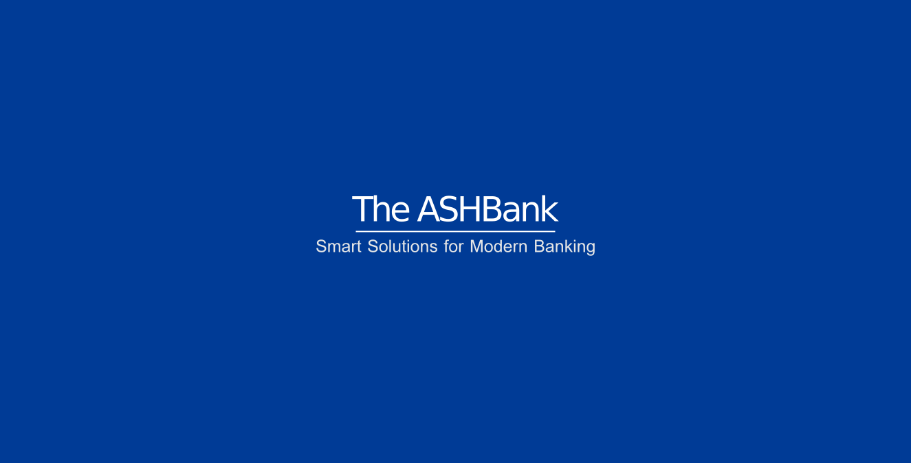

# ASHBank

## ABOUT ASHBANK
ASHBank is a simple banking platform which aims to deliver a robust, secure, and user-friendly application to manage core banking functionalities such as account creation, deposits, withdrawals, balance inquiries, and transaction tracking. Our vision is to build a foundation for integrating future FinTech innovations like advanced analytics and personalized financial services.

## Contents
- [Architecture](#architecture)
- [Technology](#technology)
  - [Technology Tools](#technology-tools)
  - [Third Party Libraries](#third-party-libraries)
- [Development Report](#development-report)
  - [Success](#success)
  - [Challenges](#challenges)
  - [Areas for Improvement](#areas-for-improvement)
  - [Lessons Learned](#lessons-learned)
  - [Next Steps](#next-steps)
- [Conclusion](#conclusion)

## Architecture
The platform follows a modular architecture for scalability and maintainability, divided into:
- Presentation Layer: JavaFX for a desktop client application.
- Business Logic Layer: Java classes handling core banking operations.
- Data Access Layer: Manages interactions with a local SQLite3 database file (currently) and is designed for future migration to a database system.

## Technology
### Technology Tools
- Programming Language: Java, leveraging its performance and ecosystem for financial applications.
- UI Framework: JavaFX for building a responsive and modern desktop interface.
- Database: SQLite3 for storing and updating customer account balances.
- Development Environment: IntelliJ Idea Community Edition
- Version Control: Git for collaboration and version management.

### Third Party Libraries
I avoided third-party libraries for this initial implementation to strengthen my foundational skills but plan to incorporate:
- Database Systems: PostgreSQL or MongoDB for future scalability.
- Build Tools: Gradle for dependency management (avoiding Maven as per our preference).

## Development Report
### Success
- Successfully implemented core functionalities such as balance updates, ensuring records are updated without appending duplicates.
- Designed a modular architecture, making the platform easy to maintain and extend.
- Utilized JavaFX modules for modernity and maintainability in UI design.
- Built foundational understanding of handling real-world challenges in software development.

### Challenges
- Database Complexity: Ensuring efficient updates without data duplication required additional effort and careful design.
- Concurrency Management: Avoiding file access conflicts when handling multiple operations concurrently.
- User Experience: Initial UI prototypes lacked intuitiveness, requiring iterative improvements.
- Time Management: Balancing development tasks with learning new concepts, especially with limited exposure to finance.

### Areas for Improvement
- Database Integration: Transition from file-based data storage to a relational or NoSQL database for reliability and scalability.
- Error Handling: Enhance error reporting and logging mechanisms for easier debugging.
- Security: Implement encryption for sensitive data such as customer records and transaction details.
- Documentation: Improve internal and external documentation to streamline onboarding and maintenance.

### Lessons Learned
- Modular design simplifies testing, debugging, and future feature integration.
- Early user feedback is critical for improving usability and functionality.
- Effective error handling and logging save significant time during development and maintenance.
- Striking a balance between ambition and achievable milestones is key to maintaining motivation and progress.

### Next Steps
- Database Migration: Transition to PostgreSQL for data storage.
- Enhanced UI: Integrate advanced JavaFX components for an improved user experience.
- Automated Testing: Expand unit and integration tests to cover edge cases.
- Scalability: Introduce multi-threading and API integrations for concurrent operations and external services.

## Conclusion
Building this banking platform has been a transformative journey for me, blending theoretical knowledge with practical application. While I have celebrated notable successes, I also faced challenges that taught me resilience and adaptability.
This project strengthened my technical skills, teamwork (with **ChatGPT**), and understanding of user-centric development.
As I move forward, I am excited to enhance this platform into a robust and scalable solution, bringing me closer to my goal of driving innovation in FinTech.
